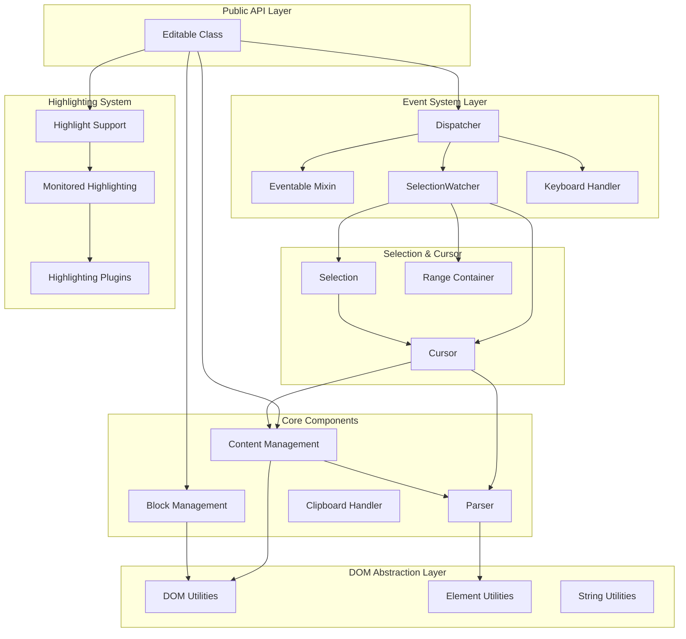
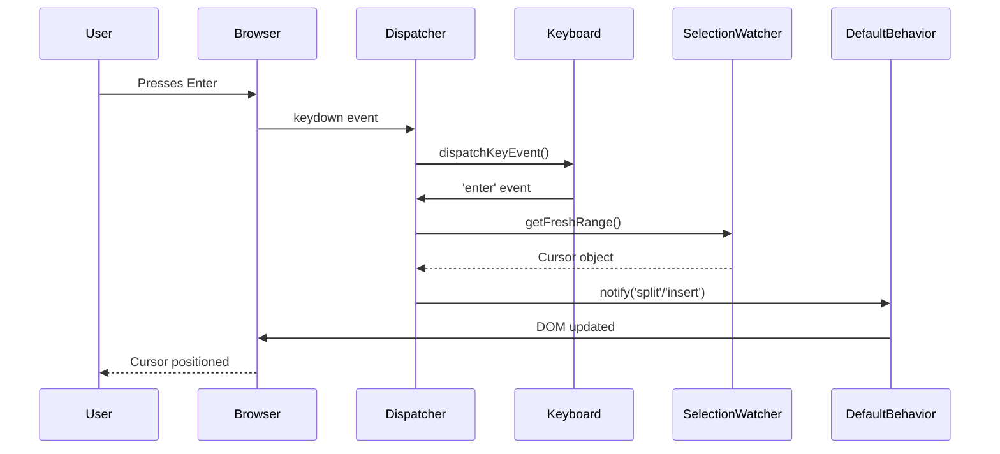
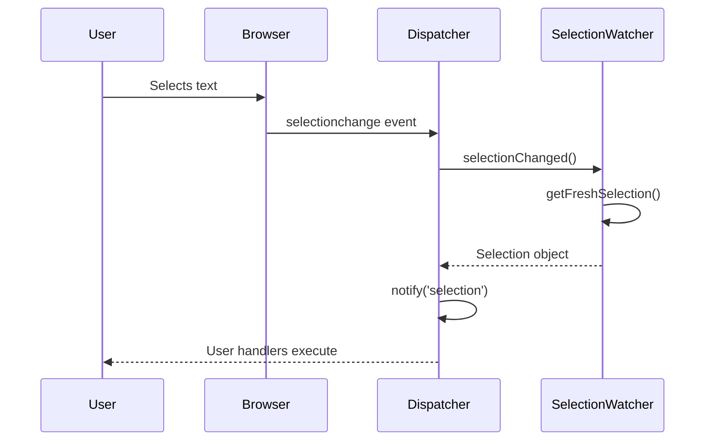

# editable.ts

A TypeScript library that provides a friendly and browser-consistent API for `contenteditable` elements. Built for block-level rich text editing with a clean, event-driven architecture. It is a fork of [https://github.com/livingdocsIO/editable.js](https://github.com/livingdocsIO/editable.js) but written in typescript.

## Summary

**editable.ts** is a modern TypeScript rewrite of editable.js, offering a robust abstraction layer over the browser's native `contenteditable` API. It handles cross-browser inconsistencies, provides a structured event system, and enables building rich text editors with minimal boilerplate.

### Key Features

- **Cross-browser compatibility** - Abstracts away browser differences in Selection and Range APIs
- **Event-driven architecture** - Clean pub/sub system for handling user interactions
- **Block-based editing** - Optimized for block-level elements (paragraphs, headings, blockquotes)
- **Selection & Cursor management** - Powerful APIs for manipulating text selections and cursor positions
- **Highlighting system** - Built-in support for text highlighting, spellcheck, and custom markers
- **Default behaviors** - Sensible defaults for common operations (split, merge, insert blocks)
- **TypeScript support** - Full type definitions and modern TypeScript implementation
- **Extensible** - Easy to customize and extend with custom event handlers

### Use Cases

- Rich text editors
- Content management systems
- Comment and annotation systems
- Collaborative editing interfaces
- Inline editing components

Check out the [original editable.js live demo](https://livingdocsio.github.io/editable.js/) for a reference implementation (note: this is the JavaScript version, not this TypeScript fork).

## What is it about?

A JavaScript API that defines a friendly and browser-consistent content editable interface.

Editable is built for block level elements containing only phrasing content. This normally means `p`, `h1`-`h6`, `blockquote` etc. elements. This allows editable to be lean and mean since it is only concerned with formatting and not with layouting.

We made editable.ts to support our vision of online document editing. Have a look at [livingdocs.io](http://livingdocs.io/).

## Architecture Overview

editable.ts follows a layered architecture that separates concerns and provides clear extension points.

### High-Level Architecture



### Core Components

#### 1. Editable Class (`core.ts`)

The main entry point and public API. Provides a clean, chainable interface for all operations.

**Key Responsibilities:**
- Exposes the public API for end users
- Manages instance-specific configuration
- Delegates to specialized modules
- Provides cursor/selection creation utilities
- Handles highlighting operations

**Key Methods:**
- `add()` / `remove()` - Enable/disable editable functionality
- `enable()` / `disable()` - Control editable state
- `on()` / `off()` - Event subscription
- `getSelection()` - Get current selection/cursor
- `highlight()` - Text highlighting functionality
- `getContent()` - Extract clean content

#### 2. Dispatcher (`dispatcher.ts`)

Central event coordination hub that bridges native DOM events to the internal event system.

**Event Flow:**
```
Native DOM Event
    ↓
Dispatcher (setupDocumentListener)
    ↓
Event Handler (filter by editable block)
    ↓
SelectionWatcher (get current selection/cursor)
    ↓
Dispatcher.notify() (emit internal event)
    ↓
Event Handlers (user-defined callbacks)
```

#### 3. Event System (`eventable.ts`)

Lightweight publish/subscribe mixin implementing the Observer pattern.

**API:**
- `on(event, handler)` - Subscribe to events
- `off(event, handler)` - Unsubscribe from events
- `notify(event, ...args)` - Publish events

#### 4. Selection & Cursor System

**SelectionWatcher** - Monitors browser Selection API and converts to internal Cursor/Selection objects

**Cursor** - Represents a collapsed selection (cursor position) with capabilities for:
- Position querying (beginning, end, line detection)
- Content insertion/manipulation
- Tag detection (bold, italic, links, etc.)
- Coordinate calculations

**Selection** - Extends Cursor, represents a non-collapsed selection with additional capabilities:
- Text/HTML extraction
- Selection wrapping (links, formatting)
- Range validation
- Multiple rect support

#### 5. Block Management (`block.ts`)

Manages the lifecycle and state of individual editable block elements.

#### 6. Content Management (`content.ts`)

Handles all content manipulation, extraction, and normalization:
- HTML normalization
- Content extraction (removes internal markers)
- Fragment creation
- Tag wrapping/unwrapping

#### 7. Highlighting System

Comprehensive highlighting support including:
- Spellcheck integration
- Text search highlighting
- Range-based highlighting
- Highlight persistence during editing
- Custom highlight types

### Data Flow Examples

#### User Types Enter Key



#### User Selects Text



For a detailed technical deep-dive, see [ARCHITECTURE.md](docs/ARCHITECTURE.md).

## Installation

Via npm:

```shell
npm install --save editable.ts
```

You can either `import` the module or find a prebuilt file in the npm bundle `dist/editable.umd.cjs`.

```typescript
import { Editable } from 'editable.ts'
```

## Quick Start

### Basic Usage

To make an element editable:

```typescript
import { Editable } from 'editable.ts'

// Create an instance
const editable = new Editable()

// Make an element editable
const element = document.querySelector('.my-editable')
editable.add(element)
```

### TypeScript Example

```typescript
import { Editable } from 'editable.ts'

const editable = new Editable({
  defaultBehavior: true,
  browserSpellcheck: true
})

// Add editable functionality to elements
editable.add(document.querySelectorAll('.editable-block'))
```

## Examples

### Selection Changes with Toolbar

In a `selection` event you get the editable element that triggered the event as well as a selection object. Through the selection object you can get information about the selection like coordinates or the text it contains and you can manipulate the selection.

In the following example we show a toolbar on top of the selection whenever the user has selected something inside of an editable element.

```typescript
editable.on('selection', (editableElement: HTMLElement, selection: Selection | null) => {
  if (!selection) {
    toolbar.hide()
    return
  }

  // Get coordinates relative to the document (suited for absolutely positioned elements)
  const coords = selection.getCoordinates()

  // Position toolbar
  const top = coords.top - toolbar.outerHeight()
  const left = coords.left + (coords.width / 2) - (toolbar.outerWidth() / 2)
  toolbar.css({top, left}).show()
})
```

### Cursor Manipulation

Create and manipulate cursors programmatically:

```typescript
// Get current cursor/selection
const cursor = editable.getSelection()

if (cursor && cursor.isCursor) {
  // Check if cursor is at beginning of block
  if (cursor.isAtBeginning()) {
    console.log('Cursor is at the beginning')
  }

  // Insert text at cursor position
  cursor.insert('Hello, World!')

  // Create cursor at specific position
  const newCursor = editable.createCursor(element, 'end')
  newCursor?.insertAfter('<strong>Bold text</strong>')
}
```

### Content Extraction

Extract clean content from editable elements:

```typescript
// Get clean HTML content (removes internal markers)
const content = editable.getContent(element)
console.log(content) // Clean HTML string

// Get selection text
const selection = editable.getSelection(element)
if (selection && selection.isSelection) {
  const selectedText = selection.text()
  const selectedHtml = selection.html()
  console.log('Selected text:', selectedText)
  console.log('Selected HTML:', selectedHtml)
}
```

### Event Handling

Handle multiple events with a clean API:

```typescript
// Handle focus events
editable.on('focus', (element: HTMLElement) => {
  console.log('Element focused:', element)
})

// Handle content changes
editable.on('change', (element: HTMLElement) => {
  console.log('Content changed in:', element)
  // Auto-save, validation, etc.
})

// Handle block splits (Enter key in middle of block)
editable.on('split', (element: HTMLElement, cursor: Cursor) => {
  console.log('Block split at:', cursor)
  // Custom split behavior
})

// Handle block merges (Backspace/Delete at boundaries)
editable.on('merge', (element: HTMLElement, cursor: Cursor) => {
  console.log('Blocks merged at:', cursor)
  // Custom merge behavior
})
```

### Highlighting

Add text highlighting and spellcheck:

```typescript
// Highlight specific text
const highlightId = editable.highlight({
  editableHost: element,
  text: 'search term',
  highlightId: 'search-1',
  type: 'search'
})

// Highlight specific range
editable.highlight({
  editableHost: element,
  text: 'important',
  highlightId: 'important-1',
  textRange: { start: 10, end: 18 },
  type: 'comment'
})

// Setup spellcheck
editable.setupSpellcheck({
  throttle: 300,
  spellcheckService: (text: string) => {
    // Your spellcheck service
    return checkSpelling(text)
  }
})

// Remove highlight
editable.removeHighlight({
  editableHost: element,
  highlightId: 'search-1'
})
```

### Custom Event Handlers

Override default behaviors:

```typescript
// Disable default behavior and implement custom
const editable = new Editable({
  defaultBehavior: false
})

// Custom Enter key handling
editable.on('keydown', (element: HTMLElement, event: KeyboardEvent) => {
  if (event.key === 'Enter') {
    event.preventDefault()
    // Custom Enter behavior
    insertCustomBlock(element)
  }
})
```

## Events Overview

editable.ts emits a comprehensive set of events for all user interactions:

### Core Events

- **focus**  
  Fired when an editable element gets focus.

- **blur**  
  Fired when an editable element loses focus.

- **selection**  
  Fired when the user selects some text inside an editable element.

- **cursor**  
  Fired when the cursor position changes.

- **change**  
  Fired when the user has made a change.

- **input**  
  Fired on user input.

### Content Modification Events

- **insert**  
  Fired when the user presses `ENTER` at the beginning or end of an editable (For example you can insert a new paragraph after the element if this happens).

- **split**  
  Fired when the user presses `ENTER` in the middle of an element.

- **merge**  
  Fired when the user pressed `FORWARD DELETE` at the end or `BACKSPACE` at the beginning of an element.

- **newline**  
  Fired when the user presses `SHIFT+ENTER` to insert a newline.

- **switch**  
  Fired when the user pressed an `ARROW KEY` at the top or bottom so that you may want to set the cursor into the preceding or following element.

### Clipboard Events

- **clipboard**  
  Fired for `copy`, `cut` and `paste` events.

- **paste**  
  Fired specifically on paste operations.

### Highlighting Events

- **spellcheckUpdated**  
  Fired when the spellcheckService has updated the spellcheck highlights.

## API Reference

For detailed API documentation, see the source files:

- **[core.ts](src/core.ts)** - Main Editable class and public API
- **[cursor.ts](src/cursor.ts)** - Cursor manipulation API
- **[selection.ts](src/selection.ts)** - Selection manipulation API
- **[dispatcher.ts](src/dispatcher.ts)** - Event system internals
- **[create-default-behavior.ts](src/create-default-behavior.ts)** - Default behavior implementation

### Type Definitions

```typescript
interface EditableConfig {
  window?: Window
  defaultBehavior?: boolean
  mouseMoveSelectionChanges?: boolean
  browserSpellcheck?: boolean
}

interface HighlightOptions {
  editableHost: HTMLElement
  text: string
  highlightId: string
  textRange?: { start: number; end: number }
  raiseEvents?: boolean
  type?: string
}
```

## Development

### Setup

```bash
# Install node dependencies
npm install
```

### Development Tasks

```bash
# Development server with demo app (Vite dev server)
npm start

# Run tests (Vitest)
npm test

# Run tests in watch mode
npm run test:watch

# Run tests with coverage
npm run test:coverage

# Run tests with interactive UI
npm run test:ui

# TypeScript/JavaScript linting
npm run lint

# Build editable.ts (TypeScript → lib/, then bundle → dist/)
npm run build

# Build TypeScript only
npm run build:ts

# Build library bundle only
npm run build:dist

# Build examples only
npm run build:docs
```

### Requirements

- Node.js >= 22
- npm >= 11

## License

editable.ts is licensed under the [MIT License](LICENSE).
