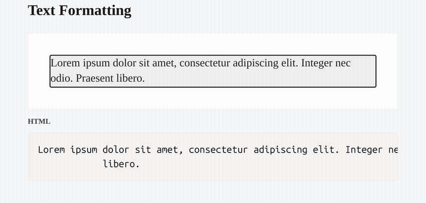

# editable.ts

[](https://www.npmjs.com/package/editable.ts)
[](https://github.com/watzak/editable.ts)
[](https://github.com/watzak/editable.ts/actions/workflows/ci.yml)
[](LICENSE)
[](#bundle-size)

<p align="center">
  <a href="https://watzak.github.io/editable.ts/examples/">
    <picture>
      <source media="(prefers-reduced-motion: reduce)" srcset=".github/assets/demo.png">
      
    </picture>
  </a>
</p>

**A lightweight, typed API for block-level `contenteditable` editing.**

editable.ts wraps the browser's native `contenteditable` with cross-browser Selection/Range handling, a typed event system, and optional highlighting — without imposing a document model. Forked from [editable.js](https://github.com/livingdocsIO/editable.js) and modernized with TypeScript, Vitest, and Vite.

**[GitHub](https://github.com/watzak/editable.ts)** · **[Live demo](https://watzak.github.io/editable.ts/examples/)** · **[npm](https://www.npmjs.com/package/editable.ts)** · **[Migration from editable.js](docs/MIGRATION.md)** · **[Architecture](docs/ARCHITECTURE.md)** · **[Yjs binding (experimental)](docs/yjs-binding.md)**

> **Privacy:** the demo page includes a Matomo image tracker (`matomo.kamod.ch`) for anonymous usage statistics. The npm library contains no analytics.

> **Support:** if editable.ts is helpful, [star the repository on GitHub](https://github.com/watzak/editable.ts) — thank you!

## Why editable.ts?

|                  | editable.ts                       | TipTap / Lexical / ProseMirror | Raw `contenteditable` |
| ---------------- | --------------------------------- | ------------------------------ | --------------------- |
| Bundle (typical) | **~2.7 KB gzip** (core)           | 50 KB – 200 KB+                | 0 KB                  |
| Document model   | **Your HTML/DOM**                 | Custom schema                  | Browser DOM           |
| Collaboration    | **Optional** `./yjs` + Y.Text     | Built-in (varies)              | Roll your own         |
| Learning curve   | **Low** — events + DOM            | Medium – high                  | High (browser quirks) |
| Best for         | CMS blocks, inline edit, comments | Full rich-text apps            | Prototypes only       |

**Choose editable.ts when** you want lean block editing (paragraphs, headings, blockquotes), keep control of your HTML, and need selection/cursor APIs without shipping a full editor framework. Add `./yjs` when you want CRDT sync with your own provider.

**Choose something else when** you need a bundled collaboration stack, complex document schemas, or a plug-and-play toolbar editor out of the box.

## Features

- **Cross-browser compatibility** — abstracts Selection and Range API differences
- **Event-driven architecture** — typed pub/sub for focus, selection, split, merge, paste, and more
- **Operation batches** — deterministic insert/delete/replace/attribute ops for custom sync adapters
- **Block-based editing** — optimized for `p`, `h1`–`h6`, `blockquote`, and other phrasing-content blocks
- **Selection & cursor APIs** — coordinates, insertion, wrapping, tag detection
- **Optional features entry** — highlighting, spellcheck overlays, text diff (tree-shakeable)
- **Optional Yjs binding** — sync one block host to `Y.Text`, with presence, undo, and structural hooks (experimental)
- **Sensible defaults** — split, merge, and insert blocks with `defaultBehavior: true`
- **TypeScript-first** — full `.d.ts` exports, typed event payloads

## Installation

```shell
npm install editable.ts
```

```typescript
import { Editable } from 'editable.ts'
```

For collaborative editing, add optional peers (not pulled in by default):

```shell
npm install yjs y-protocols
```

Or use the prebuilt UMD bundle: `dist/editable.umd.cjs` (core only — no Yjs).

### SSR and iframe integration

`editable.ts` can be imported in Node/SSR environments without a browser `window` or `document`. Module initialization no longer touches global browser APIs; constructing `new Editable()` requires a real `Window` (typically after client mount/hydration).

```typescript
// Server bundle — import is safe
import { Editable } from 'editable.ts'

// Client-only — after mount
const editable = new Editable({ window: iframeRef.current?.contentWindow ?? window })
editable.add(blockElement)
```

For embedded editors, pass the iframe's `contentWindow` via `{ window }`. DOM nodes, `NodeList`s, and selector strings from that document are supported; cross-realm elements are adopted into the configured document on `add()`/`enable()`. Feature detection (for example `selectionchange` support) is evaluated per window and cached internally.

### Input pipeline (IME, mobile, beforeinput)

Editing commands are normalized from native events per window:

1. **`beforeinput`** (preferred when supported) — maps `inputType` to semantic commands (`insertParagraph`, `insertLineBreak`, `deleteContentBackward`, `deleteContentForward`, `formatBold`, `formatItalic`). Paste (`insertFromPaste`) is delegated to the existing secure `paste` listener.
2. **`keydown`** (fallback) — handles the same editing commands when `beforeinput` is unavailable or did not run; always handles arrow navigation, Tab, and Esc.
3. **Composition** — `compositionstart`/`compositionend` track per-block IME state; structural commands are suppressed while composing (`isComposing`, keyCode `229`).
4. **Dedup** — a handled `beforeinput` suppresses only the paired `keydown` for that gesture; repeated key presses are not blocked.

Capability detection probes `onbeforeinput` and `InputEvent.prototype.inputType` (no user-agent sniffing). See `docs/ARCHITECTURE.md` for the full event flow.

### Package exports: core vs. features

| Import                 | Purpose                                                                                   |
| ---------------------- | ----------------------------------------------------------------------------------------- |
| `editable.ts`          | Lean entry: `Editable`, events, cursor, content, operations — **without** highlighting/text-diff or Yjs |
| `editable.ts/features` | Same class plus `highlight`, `setupHighlighting`, `setupSpellcheck`, `setupTextDiff`, …   |
| `editable.ts/yjs`      | `EditableYjsBinding`, presence, undo, structural hooks — **experimental**; Yjs is external |

Types such as `HighlightOptions` and `TextDiffOptions` are re-exported from the core entry for convenience:

```typescript
import { Editable, type HighlightOptions } from 'editable.ts'

// Core only (smaller bundle)
import { Editable } from 'editable.ts'

// With highlighting / spellcheck overlays / text diff
import { Editable } from 'editable.ts/features'

// With Yjs CRDT sync (requires yjs + y-protocols peers)
import { EditableYjsBinding } from 'editable.ts/yjs'
```

### Bundle size

| Artifact                            | Size (approx.)        | Notes                                                                  |
| ----------------------------------- | --------------------- | ---------------------------------------------------------------------- |
| `lib/core.js` (ESM)                 | ~10.5 KB (~2.7 KB gzip) | Core entry; bundlers tree-shake further modules                      |
| `lib/features.js`                   | ~3 KB (~0.9 KB gzip)  | Optional entry; pulls in highlight/text-diff code                    |
| `lib/yjs/editable-yjs-binding.js`   | ~13 KB (~3.2 KB gzip) | Optional; Yjs is a peer — not bundled into core or UMD               |
| `lib/yjs/binding-undo.js`           | ~6 KB (~1.6 KB gzip)  | Optional undo controller                                             |
| `lib/yjs/editable-yjs-presence.js`  | ~9 KB (~2.1 KB gzip)  | Optional remote cursors via Awareness                                |
| `dist/editable.umd.cjs`             | ~91 KB (~26 KB gzip)  | Single file for `<script>` / legacy bundlers (core only)             |
| `lib/` (total, unpacked)            | <1 MB                 | Publish build omits source maps; bundlers include only what you import |

Verify locally after `npm run build`:

```shell
ls -la dist/ lib/core.js
gzip -c dist/editable.umd.cjs | wc -c
```

### Performance notes

- Create one `Editable` instance per logical editor (or group of blocks that share the same configuration). Document-level DOM listeners are shared internally, but each instance tracks its own blocks and event subscriptions.
- Multiple instances in the same document are supported: each block is owned by exactly one instance. Adding a block to a second instance transfers ownership to that instance.
- Per-instance paste rules can be set via the constructor (`pastedHtmlRules`) without affecting other instances. `Editable.globalConfig()` still defines defaults for newly created instances.
- Keep `mouseMoveSelectionChanges: false` (the default) for documents with many blocks; it suppresses noisy selection updates while dragging.
- Call `editable.unload()` when an editor view is removed so shared document listeners and subscriptions can be released.
- Import `editable.ts/features` only when highlighting, spellcheck overlays, or text diff are needed. Tune `setupSpellcheck({ throttle })` for long blocks or remote spellcheck services.
- Import `editable.ts/yjs` only when syncing to `Y.Text`. `yjs` and `y-protocols` are optional peers — core and UMD builds stay Yjs-free.

## Quick start

```typescript
import { Editable } from 'editable.ts'

const editable = new Editable({
  defaultBehavior: true,
  browserSpellcheck: true,
  smartQuotes: true,
  quotes: ['“', '”'],
  singleQuotes: ['‘', '’'],
  pastedHtmlRules: {
    allowedElements: {
      a: { href: true },
      strong: {},
      em: {},
      br: {}
    }
  }
})

const element = document.querySelector('.my-editable')
editable.add(element)
```

## Examples

### Selection toolbar (vanilla DOM)

Show a floating toolbar when the user selects text:

```typescript
const toolbar = document.getElementById('toolbar')!

editable.on('selection', (_element, selection) => {
  if (!selection) {
    toolbar.hidden = true
    return
  }

  const coords = selection.getCoordinates()
  const toolbarHeight = toolbar.offsetHeight
  const toolbarWidth = toolbar.offsetWidth

  toolbar.style.top = `${coords.top - toolbarHeight}px`
  toolbar.style.left = `${coords.left + coords.width / 2 - toolbarWidth / 2}px`
  toolbar.hidden = false
})
```

### Cursor manipulation

```typescript
const cursor = editable.getSelection()

if (cursor?.isCursor) {
  if (cursor.isAtBeginning()) {
    console.log('Cursor is at the beginning')
  }

  cursor.insert('Hello, World!')

  const newCursor = editable.createCursor(element, 'end')
  newCursor?.insertAfter('<strong>Bold text</strong>')
}
```

### Content extraction

```typescript
const content = editable.getContent(element)

const selection = editable.getSelection(element)
if (selection?.isSelection) {
  console.log(selection.text(), selection.html())
}
```

### Event handling

```typescript
editable.on('focus', (element) => console.log('focused', element))
editable.on('change', (element) => console.log('changed', element))

editable.on('split', (element, before, after, cursor) => {
  console.log('Block split:', { before, after, cursor })
})

editable.on('merge', (element, direction, cursor) => {
  console.log('Blocks merged:', { direction, cursor })
})
```

### Highlighting

Import the features entry so these methods exist on `Editable`:

```typescript
import { Editable } from 'editable.ts/features'

const editable = new Editable()
editable.add(element)

editable.highlight({
  editableHost: element,
  text: 'search term',
  highlightId: 'search-1',
  type: 'search'
})

editable.setupSpellcheck({
  throttle: 300,
  spellcheckService: (text, callback) => callback(checkSpelling(text))
})

editable.setupTextDiff({ checkOnInit: true, throttle: 0 })

editable.removeHighlight({ editableHost: element, highlightId: 'search-1' })
```

### Custom behavior (legacy events)

```typescript
const editable = new Editable({ defaultBehavior: false })

editable.on('insert', (element, direction, cursor) => {
  insertCustomBlock(element, direction, cursor)
})
```

### DOM editor with default behavior

```typescript
import { Editable } from 'editable.ts'

const editable = new Editable({ defaultBehavior: true })
editable.add(document.querySelector('.paragraph')!)

// Optional: observe typed commands without replacing DOM handlers
editable.on('command', (command) => {
  console.log(command.type, command.source)
})

// Optional: cancel a specific default action
editable.on('beforeCommand', (ctx) => {
  if (ctx.command.type === 'mergeBlock') ctx.cancel()
})

editable.on('change', (element, details) => {
  // details is optional — legacy handlers with one argument still work
  saveSnapshot(element, details?.command)
})
```

### Adapter for an external document model

```typescript
import { Editable, type EditableCommand } from 'editable.ts'

const editable = new Editable({ defaultBehavior: false })

editable.on('command', (command: EditableCommand) => {
  switch (command.type) {
    case 'splitBlock':
      doc.splitBlock(command.host, command.cursor.offset, command.htmlAfter)
      break
    case 'insertBlock':
      doc.insertBlock(command.host, command.direction)
      break
    case 'mergeBlock':
      doc.mergeBlock(command.host, command.direction)
      break
    case 'paste':
      doc.pasteBlocks(command.host, command.blocks, command.cursor.offset)
      break
    case 'format':
      doc.toggleFormat(command.host, command.format, command.selection)
      break
  }
})

// Legacy events remain available for gradual migration
editable.on('split', (element, before, after, cursor) => {
  /* same payload as pre-1.2 handlers */
})
```

Cursor and selection offsets in commands use **UTF-16 code units** (JavaScript string indices). Surrogate pairs such as emoji count as two units; combining diacritics are separate from their base character.

### Operation batches (custom sync)

Local edits emit typed `EditableOperationBatch` objects on the `operation` event. Apply remote batches atomically with live DOM patches (no full `innerHTML` replacement):

```typescript
import { Editable, type EditableOperationBatch } from 'editable.ts'

const editable = new Editable()

editable.on('operation', (host, batch) => {
  sendToPeers(host, batch)
})

editable.applyOperations(host, remoteBatch, {
  preserveSelection: true,
  emitChange: true
})
```

See [docs/apply-operations.md](docs/apply-operations.md) and [docs/adr/0001-commands-and-operations.md](docs/adr/0001-commands-and-operations.md).

### Collaborative editing with Yjs (experimental)

The optional `./yjs` subpath connects one block host to one `Y.Text`. After initial sync, **`Y.Text` is canonical**. Providers (WebSocket, WebRTC, etc.) are integrator-owned — not shipped with editable.ts.

```typescript
import * as Y from 'yjs'
import { Editable } from 'editable.ts'
import { EditableYjsBinding } from 'editable.ts/yjs'

const doc = new Y.Doc()
const yText = doc.getText('block-1')
const editable = new Editable()
const host = document.querySelector('.paragraph')!
editable.add(host)

const binding = new EditableYjsBinding({
  editable,
  host,
  yText,
  initialSync: {
    yEmptyHostFilled: 'copy-host-to-y',
    hostEmptyYFilled: 'copy-y-to-host',
    bothFilledDiffer: 'error'
  },
  undo: { captureTimeout: 500 } // optional Y.UndoManager integration
})

// Wire your provider here — e.g. y-websocket, y-webrtc
// provider.on('sync', …)

binding.destroy() // before editable.unload(host)
```

Optional modules on the same subpath:

- **`EditableYjsPresence`** — remote cursors via `y-protocols/awareness` (never written to `Y.Text`)
- **`YjsBindingUndoController`** — per-binding undo/redo scoped to local edits
- **Structural adapter hooks** — map split/merge/paste to your own `Y.Array` / block tree

Live demos: [rich-text sync](examples/yjs-rich-editor.html) · [presence](examples/yjs-presence-editor.html) · [full collab RC](examples/yjs-collab-demo.html)

Full API, security notes, and lifecycle: [docs/yjs-binding.md](docs/yjs-binding.md) · provider sketch: [docs/yjs-provider-example.md](docs/yjs-provider-example.md)

> **Experimental:** the `./yjs` API may change before stable `1.3.0`. Core, features, and UMD remain Yjs-free.

## Events

### Core

| Event       | When                                                       |
| ----------- | ---------------------------------------------------------- |
| `focus`     | Editable element receives focus                            |
| `blur`      | Editable element loses focus                               |
| `selection` | Text is selected                                           |
| `cursor`    | Cursor position changes                                    |
| `change`    | Content changed (optional `ChangeDetails` as 2nd argument) |

### Content modification

| Event            | When                                                 |
| ---------------- | ---------------------------------------------------- |
| `beforeCommand`  | Before default behavior; call `ctx.cancel()` to skip |
| `command`        | Typed `EditableCommand` for every structural edit    |
| `operation`      | Typed `EditableOperationBatch` after local text edits |
| `insert`         | Enter at beginning or end of block                   |
| `split`          | Enter in the middle of a block                       |
| `merge`          | Backspace at start or Delete at end of block         |
| `newline`        | Shift+Enter                                          |
| `switch`         | Arrow key at block boundary (move to adjacent block) |
| `toggleBold`     | Bold shortcut (Ctrl/Cmd+B)                           |
| `toggleEmphasis` | Italic shortcut (Ctrl/Cmd+I)                         |

### Clipboard & highlighting

| Event               | When                          |
| ------------------- | ----------------------------- |
| `clipboard`         | Copy, cut, or paste           |
| `paste`             | Paste operation               |
| `spellcheckUpdated` | Spellcheck highlights updated |

## API reference

| Module                                 | Description                                          |
| -------------------------------------- | ---------------------------------------------------- |
| [core.ts](src/core.ts)                 | Main `Editable` class, operations, commands          |
| [features.ts](src/features.ts)         | Optional highlighting / spellcheck / text-diff entry |
| [yjs/index.ts](src/yjs/index.ts)       | Optional Yjs binding, presence, undo (experimental)  |
| [cursor.ts](src/cursor.ts)             | Cursor API                                           |
| [selection.ts](src/selection.ts)       | Selection API                                        |
| [event-types.ts](src/event-types.ts)   | Typed event payloads                                 |
| [plugin-types.ts](src/plugin-types.ts) | Highlight and text-diff types                        |

See [docs/ARCHITECTURE.md](docs/ARCHITECTURE.md) for a technical deep-dive.

### Config types

```typescript
interface EditableConfig {
  window?: Window
  defaultBehavior?: boolean
  mouseMoveSelectionChanges?: boolean
  browserSpellcheck?: boolean
  smartQuotes?: boolean
  quotes?: string[]
  singleQuotes?: string[]
}
```

## Browser support (automated)

Cross-browser behavior is verified with Playwright E2E tests on desktop browser **engines** (not pinned vendor versions):

| Engine   | Desktop profile | E2E coverage                                                                               |
| -------- | --------------- | ------------------------------------------------------------------------------------------ |
| Chromium | Desktop Chrome  | Enter/split/merge, paste, formatting, lifecycle, iframe, dual instance, IME guard, unicode, Yjs collab |
| Firefox  | Desktop Firefox | Same suite as Chromium                                                                                 |
| WebKit   | Desktop Safari  | Same suite as Chromium                                                                                 |

**Known limitations**

- Native `document.execCommand('undo'/'redo')` after structural edits is engine-dependent; undo E2E tests skip when the browser undo stack is unavailable. Yjs binding undo uses `Y.UndoManager` instead.
- IME/composition is simulated via composition events; real OS input method behavior is not fully replicated in CI — manual QA recommended for `./yjs`.
- Mobile browsers and legacy IE are not covered by the automated matrix.
- `./yjs` does not ship a network provider; integrators wire WebSocket/WebRTC themselves.

## Development

```bash
npm install
npm run dev        # demo (Vite dev server)
npm test           # Vitest + lint + format
npm run verify     # full pre-release gate (typecheck, coverage, lint, build, package)
npm run test:e2e   # Playwright (Chromium, Firefox, WebKit)
npm run build      # lib/ + dist/ + demo bundle
npm run size       # bundle-size guard
npm run knip       # unused file/dependency check
```

See [CONTRIBUTING.md](CONTRIBUTING.md) for pull request guidelines.

**Requirements:** Node.js >= 22, npm >= 11

## Related projects

- [editable.js](https://github.com/livingdocsIO/editable.js) — original JavaScript library (see [migration guide](docs/MIGRATION.md))
- [livingdocs.io](https://livingdocs.io/) — online document editing platform

## License

[MIT License](LICENSE)
