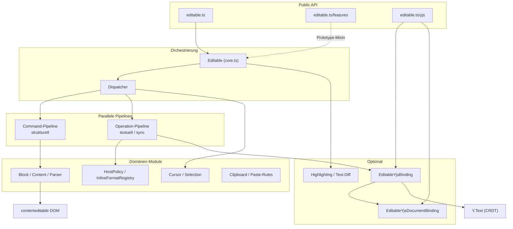
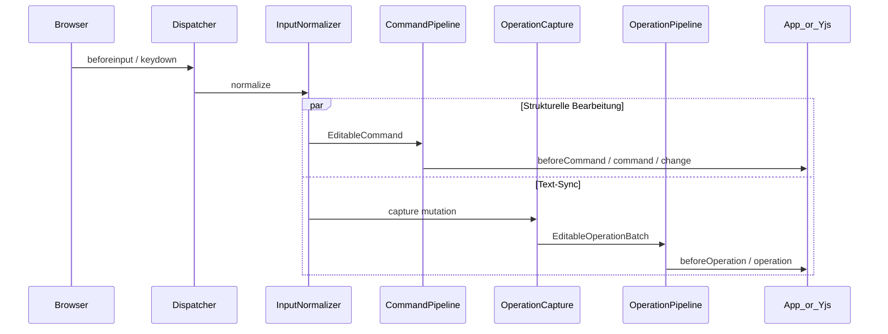
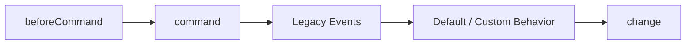
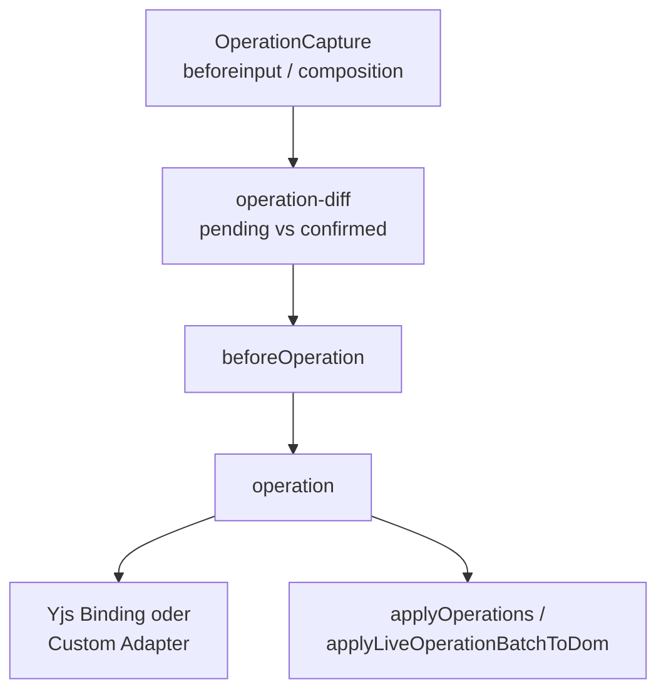
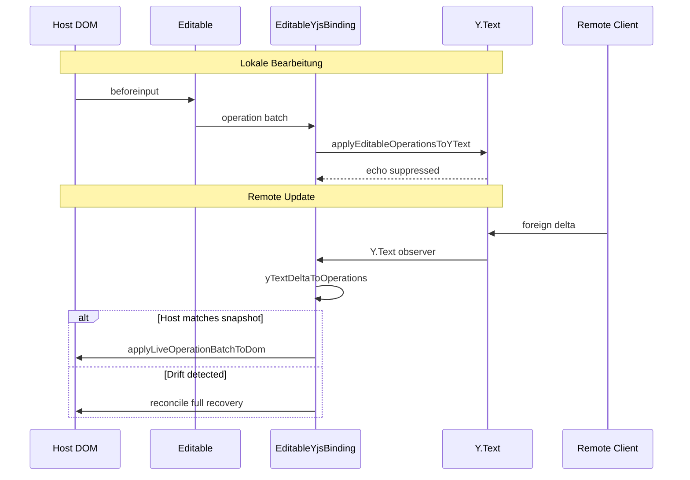
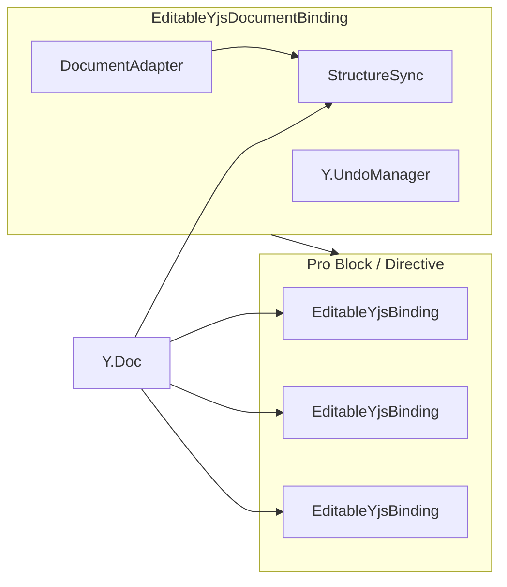

# Architektur (DE)

editable.ts folgt einer geschichteten Architektur mit klaren Erweiterungspunkten. Dieses Dokument beschreibt die Schichten, Datenflüsse und optionalen Module auf Deutsch. Die englische Fassung in [ARCHITECTURE.md](./ARCHITECTURE.md) bleibt die kanonische Referenz für technische Details.

## Einleitung und Designprinzipien

**editable.ts** ist eine schlanke TypeScript-Bibliothek (~2.7 KB gzip Core), die natives `contenteditable` kapselt. Sie abstrahiert browserübergreifende Selection-/Range-Unterschiede, bietet ein typisiertes Event-System und optionale Highlighting-/CRDT-Erweiterungen — **ohne** ein eigenes Dokumentmodell aufzuzwingen.

| Prinzip                        | Bedeutung                                                                                                       |
| ------------------------------ | --------------------------------------------------------------------------------------------------------------- |
| **DOM ist das Modell**         | Host-HTML bleibt kanonisch, bis eine Yjs-Binding `Y.Text` als Quelle der Wahrheit setzt                         |
| **Keine Runtime-Dependencies** | Core und Features haben null Produktions-Dependencies; Yjs ist optionaler Peer                                  |
| **Tree-shakebare Einstiege**   | Core, Features und Yjs sind getrennte Subpaths                                                                  |
| **Zwei parallele Pipelines**   | Commands (strukturell) und Operations (textuell/sync) — siehe [ADR 0001](./adr/0001-commands-and-operations.md) |
| **UTF-16 überall**             | Offsets entsprechen JavaScript-Strings und DOM `Range#toString()`                                               |

**Wann editable.ts:** CMS-Blöcke, Inline-Editing, Kommentare — wenn du dein HTML behalten und Selection/Cursor ohne Editor-Framework nutzen willst.

**Wann etwas anderes:** TipTap / Lexical / ProseMirror, wenn du ein gebündeltes Collaboration-Stack, komplexe Schemas oder eine fertige Toolbar brauchst.

## Paket-Architektur

| Import                              | Quelldatei                                | Zweck                                                 |
| ----------------------------------- | ----------------------------------------- | ----------------------------------------------------- |
| `editable.ts`                       | [`src/core.ts`](../src/core.ts)           | Kern: `Editable`, Events, Cursor, Operations          |
| `editable.ts/features`              | [`src/features.ts`](../src/features.ts)   | Highlighting, Spellcheck, Text-Diff (Prototype-Mixin) |
| `editable.ts/yjs`                   | [`src/yjs/index.ts`](../src/yjs/index.ts) | Experimentelle CRDT-Sync-Schicht                      |
| `editable.ts/dist/editable.umd.cjs` | Vite-UMD                                  | Script-Tag / Legacy (nur Core)                        |

**Build-Pipeline:**

1. `build:ts` — `tsc` → `lib/` (ESM + `.d.ts`)
2. `build:dist` — Vite UMD → `dist/`
3. `build:docs` — Vite bündelt Examples → `examples/dist/`

`validate:core-bundle` stellt sicher, dass Core **keine** `lib/yjs/`-Imports enthält.

| Artefakt                          | Größe (ca.)  | Hinweis         |
| --------------------------------- | ------------ | --------------- |
| `lib/core.js` (ESM)               | ~2.7 KB gzip | Haupt-Einstieg  |
| `lib/features.js`                 | ~0.9 KB gzip | Optional        |
| `lib/yjs/editable-yjs-binding.js` | ~3.2 KB gzip | Yjs bleibt Peer |
| `dist/editable.umd.cjs`           | ~26 KB gzip  | Nur Core        |

## Schichtenmodell



## Kernkomponenten

### Editable (`core.ts`)

Zentrale öffentliche API und Orchestrator:

- Instanz-Konfiguration (`globalSettings`, `pasteRules`)
- Block-Ownership über [`instance-registry.ts`](../src/instance-registry.ts) (ein Block gehört genau einer Instanz)
- Delegation an `Dispatcher`, `block`, `content`, `clipboard`, `parser`
- SSR-sicher: Modul-Import braucht keinen Browser; `new Editable()` erfordert ein echtes `Window` (iframe-fähig über `{ window }`)

**Wichtige Methoden (Core):** `add` / `remove`, `enable` / `disable`, `on` / `off`, `getSelection`, `getContent`, `applyOperations`, `unload`.

**Zusätzlich mit `editable.ts/features`:** `highlight`, `setupHighlighting`, `setupSpellcheck`, `setupTextDiff`, …

### Dispatcher (`dispatcher.ts`)

Brücke von nativen DOM-Events zum internen Event-System. Besitzt Keyboard, Clipboard, Input-Pipeline, `SelectionWatcher`, `OperationCapture` und `InputCommandTracker`.

```
Native DOM Event
  → Shared Document Listener
  → Filter nach editable Block (Ownership)
  → SelectionWatcher / Keyboard / Input-Normalizer
  → Dispatcher.notify()
  → User-Handler
```

### Eventable (`eventable.ts`)

Leichtgewichtiges Pub/Sub-Mixin: `on`, `off`, `notify`. Wird auf `Dispatcher` und `Editable` angewendet.

### Block und Content

| Modul                                     | Rolle                                                    |
| ----------------------------------------- | -------------------------------------------------------- |
| [`block.ts`](../src/block.ts)             | Block-Lifecycle, `contenteditable`, Plain-Text-Erkennung |
| [`content.ts`](../src/content.ts)         | HTML-Normalisierung, Extraktion, Wrap/Unwrap             |
| [`parser.ts`](../src/parser.ts)           | DOM-Parsing, Void-Elemente                               |
| [`clipboard.ts`](../src/clipboard.ts)     | Paste mit Sanitisierung                                  |
| [`paste-rules.ts`](../src/paste-rules.ts) | Kompilierte Allowlists aus der Config                    |

## Selection und Cursor

| Modul                                                   | Rolle                                                             |
| ------------------------------------------------------- | ----------------------------------------------------------------- |
| [`selection-watcher.ts`](../src/selection-watcher.ts)   | Beobachtet die Browser-Selection → interne Objekte                |
| [`cursor.ts`](../src/cursor.ts)                         | Collapsed Selection: Position, Insert, Tag-Erkennung, Koordinaten |
| [`selection.ts`](../src/selection.ts)                   | Non-collapsed: Text/HTML, Wrapping, Multi-Rect                    |
| [`range-container.ts`](../src/range-container.ts)       | Range-Buchhaltung                                                 |
| [`range-save-restore.ts`](../src/range-save-restore.ts) | Selection über DOM-Mutationen hinweg                              |

Alle Cursor-/Selection-Offsets in Commands und Operations nutzen **UTF-16 Code Units** (wie JS-Strings und DOM `Range`). Emoji-Surrogate-Paare zählen als zwei Einheiten.

## Input-Pipeline

Bearbeitungsbefehle werden pro Fenster normalisiert:

1. **`beforeinput`** (bevorzugt) — mappt `inputType` auf semantische Commands
2. **`keydown`** (Fallback) — gleiche Editing-Commands; immer für Pfeile, Tab, Esc
3. **Composition** — `compositionstart`/`compositionend`; strukturelle Commands während IME unterdrückt
4. **Dedup** — ein behandeltes `beforeinput` unterdrückt nur den gepaarten `keydown`

Capability-Detection prüft `onbeforeinput` und `InputEvent.prototype.inputType` (kein User-Agent-Sniffing).



## Command-Pipeline

Strukturelle Browser-Eingaben werden zu einer diskriminierenden Union (`EditableCommand`) normalisiert.

| Command-Typ       | Legacy-Event(s)                  |
| ----------------- | -------------------------------- |
| `insertBlock`     | `insert`                         |
| `splitBlock`      | `split`                          |
| `mergeBlock`      | `merge`                          |
| `insertLineBreak` | `newline`                        |
| `paste`           | `paste`                          |
| `format`          | `toggleBold` / `toggleEmphasis`  |
| `input`           | nur Metadaten (Plain-Text-Input) |

**Event-Reihenfolge:**



- `beforeCommand` erhält einen `CommandContext` mit `cancel()` — Default-DOM-Verhalten verhinderbar ohne natives `preventDefault`
- Mit `defaultBehavior: false`: auf `command` hören und in das eigene Dokumentmodell übersetzen; Legacy-Events feuern weiterhin (1.x-Kompatibilität)
- Module: [`command-pipeline.ts`](../src/command-pipeline.ts), [`command-builder.ts`](../src/command-builder.ts), [`create-default-behavior.ts`](../src/create-default-behavior.ts), [`create-default-events.ts`](../src/create-default-events.ts)

## Operation-Pipeline

Parallele Schicht für deterministische, serialisierbare Text-Mutationen (Sync-Adapter, Replay, Yjs).

| Operation           | Felder                                           |
| ------------------- | ------------------------------------------------ |
| `insertText`        | `index`, `text`, optional `attributes`           |
| `deleteText`        | `index`, `length`                                |
| `replaceText`       | `index`, `length`, `text`, optional `attributes` |
| `setTextAttributes` | `index`, `length`, `attributes`                  |

- Zeilenumbrüche: DOM `<br>` → `\n` (`OPERATION_LINE_BREAK`) im Operationstext; kein HTML in Ops
- Events: `beforeOperation(host, context)` → `operation(host, batch)`
- `OperationContext.cancel()` spiegelt `CommandContext`
- DTOs enthalten **keine** `HTMLElement`-, `Event`- oder Yjs-Typen; `origin` ist batch-level und nicht wire-serialisierbar



Module: [`operation-capture.ts`](../src/operation-capture.ts), [`operation-diff.ts`](../src/operation-diff.ts), [`operation-apply.ts`](../src/operation-apply.ts), [`operation-pipeline.ts`](../src/operation-pipeline.ts), [`apply-operations.ts`](../src/apply-operations.ts), [`operation-text-model.ts`](../src/operation-text-model.ts).

Details: [apply-operations.md](./apply-operations.md), [browser-operation-fallbacks.md](./browser-operation-fallbacks.md).

## Host-Policy und Rich Text

| Modul                                                     | Rolle                                                                                      |
| --------------------------------------------------------- | ------------------------------------------------------------------------------------------ |
| [`host-policy.ts`](../src/host-policy.ts)                 | Pro Block: `allowedFormats`, `maxLength`, `plainText`, Placeholder                         |
| [`inline-format-codec.ts`](../src/inline-format-codec.ts) | `InlineFormatRegistry` — DOM ↔ Operation-/Y.Text-Attribute (**Core**, nicht unter `./yjs`) |
| [`format-operations.ts`](../src/format-operations.ts)     | Toggle-/Link-/Unlink-Operations                                                            |
| [`dom-text-runs.ts`](../src/dom-text-runs.ts)             | Text-Runs mit Inline-Format-Metadaten                                                      |

Die gleiche Registry fließt durch Capture → Apply → optionale Yjs-Delta-Konversion / Reconcile. Unbekannte oder unsichere Remote-Keys/URLs erreichen das DOM nicht.

Beispiel:

```typescript
editable.add(host, {
  plainText: false,
  allowedFormats: ['bold', 'italic', 'link'],
  allowLineBreaks: true,
  maxLength: 500,
  placeholder: 'Überschrift…'
})
```

## Optional: Features

Import `editable.ts/features` registriert Methoden auf demselben `Editable`-Prototype (Side-Effect).

| Bereich      | Module                                                                                                                 |
| ------------ | ---------------------------------------------------------------------------------------------------------------------- |
| Highlighting | [`highlight-support.ts`](../src/highlight-support.ts), [`monitored-highlighting.ts`](../src/monitored-highlighting.ts) |
| Plugins      | [`plugins/highlighting/`](../src/plugins/highlighting/) — Textsuche, Spellcheck, Whitespace                            |
| Text-Diff    | [`plugins/text-diff/`](../src/plugins/text-diff/) — Insert-/Delete-Overlays                                            |

Öffentliche Events u. a.: `spellcheckUpdated`.

## Optional: Yjs-Schicht

Komplett isoliert unter [`src/yjs/`](../src/yjs/). Core importiert **nie** Yjs. Provider (WebSocket/WebRTC) sind Integrator-Verantwortung.

### Designregeln

1. Eine Binding = ein Block-Host + ein `Y.Text`
2. Nach Initial-Sync ist **`Y.Text` kanonisch**
3. Lokale Edits: DOM-Capture → `EditableOperationBatch` → eine `Y.Doc`-Transaction (Binding-Origin, Echo-sicher)
4. Remote: `Y.Text`-Observer → Delta → Operations → Live-DOM-Patches (kein `innerHTML` im Hot Path)
5. Bei Drift: `binding.reconcile()` baut den Host aus kanonischem `Y.Text` neu (Recovery schreibt nie nach Y.Text)

### Single-Block-Sync



Zentrale Klasse: [`EditableYjsBinding`](../src/yjs/editable-yjs-binding.ts).

Weitere Module: [`initial-sync.ts`](../src/yjs/initial-sync.ts), [`reconcile.ts`](../src/yjs/reconcile.ts), [`remote-sync-state.ts`](../src/yjs/remote-sync-state.ts), [`apply-operations-to-ytext.ts`](../src/yjs/apply-operations-to-ytext.ts), [`ytext-delta-to-operations.ts`](../src/yjs/ytext-delta-to-operations.ts), [`composition-remote-sync.ts`](../src/yjs/composition-remote-sync.ts), [`binding-origin.ts`](../src/yjs/binding-origin.ts).

### Document-Binding (experimentell, CMS)

[`EditableYjsDocumentBinding`](../src/yjs/editable-yjs-document-binding.ts) koordiniert viele Single-Block-Bindings plus Struktur-Sync über einen neutralen Adapter.



- Adapter mountet Komponenten, beobachtet Struktur, liefert gemeinsamen Structural Adapter
- Shared `Y.UndoManager` für Text + Struktur
- Rendering bleibt im Adapter — die Library liefert keine CMS-Templates

### Optionale Yjs-Erweiterungen

| Modul                                                                   | Zweck                                                       |
| ----------------------------------------------------------------------- | ----------------------------------------------------------- |
| [`editable-yjs-presence.ts`](../src/yjs/editable-yjs-presence.ts)       | Remote-Cursors via Awareness (`y-protocols`)                |
| [`binding-undo.ts`](../src/yjs/binding-undo.ts)                         | `Y.UndoManager` scoped auf Binding-Origin                   |
| [`editable-yjs-annotations.ts`](../src/yjs/editable-yjs-annotations.ts) | Kommentare/Issues in separatem `Y.Map` (nicht Y.Text-Attrs) |
| [`structural-bridge.ts`](../src/yjs/structural-bridge.ts)               | Hooks für Split/Merge/Paste → Host-Blockbaum                |
| [`sync-lifecycle.ts`](../src/yjs/sync-lifecycle.ts)                     | `deferInitialSync` + `activate()` nach Provider-Ready       |

Ausführlich: [yjs-binding.md](./yjs-binding.md), [YJS_PROVIDER_INTEGRATION.md](./YJS_PROVIDER_INTEGRATION.md).

## Instanz-Management und SSR / Iframe

- Document-Listener werden über [`shared-document-listeners.ts`](../src/shared-document-listeners.ts) geteilt
- Jeder Block gehört genau einer `Editable`-Instanz; `add()` auf einer zweiten Instanz überträgt Ownership
- `getEditableBlockByEvent()` löst Host + Ownership auf
- Feature-Detection pro `Window` in einer `WeakMap` ([`feature-detection.ts`](../src/feature-detection.ts))
- Cross-Realm: `add()` / `enable()` können Elemente via `document.adoptNode()` übernehmen
- Modul-Import ist SSR-sicher; Konstruktion braucht ein reales `Window`

## Build und Qualitätssicherung

```
src/  --tsc-->  lib/ (ESM + d.ts)
src/  --Vite--> dist/editable.umd.cjs
examples/ --Vite--> examples/dist/ (GitHub Pages)
```

| Ebene         | Tooling                                           | Ort                  |
| ------------- | ------------------------------------------------- | -------------------- |
| Unit          | Vitest + jsdom                                    | [`spec/`](../spec/)  |
| E2E           | Playwright (Chromium, Firefox, WebKit)            | [`e2e/`](../e2e/)    |
| Lint / Format | oxlint, oxfmt                                     | Root                 |
| Package       | publint, attw, size-limit, `validate:core-bundle` | Scripts              |
| CI            | Quality-Job + E2E-Matrix                          | `.github/workflows/` |

Yjs-Tests umfassen Binding, Rich-Sync, Presence, Annotations, Document-Collab und Convergence-Fuzz.

## Modul-Referenz

| Modul                                                                                 | Rolle                                                      |
| ------------------------------------------------------------------------------------- | ---------------------------------------------------------- |
| [`core.ts`](../src/core.ts)                                                           | Hauptklasse `Editable`, npm-Einstieg                       |
| [`features.ts`](../src/features.ts)                                                   | Optionaler Einstieg: Highlighting / Spellcheck / Text-Diff |
| [`dispatcher.ts`](../src/dispatcher.ts)                                               | Event-Koordination, Input-Pipelines                        |
| [`eventable.ts`](../src/eventable.ts)                                                 | Pub/Sub-Mixin                                              |
| [`cursor.ts`](../src/cursor.ts) / [`selection.ts`](../src/selection.ts)               | Selection-API                                              |
| [`command-pipeline.ts`](../src/command-pipeline.ts)                                   | Strukturelle Commands                                      |
| [`operation-pipeline.ts`](../src/operation-pipeline.ts)                               | Text-Operations                                            |
| [`host-policy.ts`](../src/host-policy.ts)                                             | Per-Block-Policy                                           |
| [`inline-format-codec.ts`](../src/inline-format-codec.ts)                             | Format-Registry (Core)                                     |
| [`instance-registry.ts`](../src/instance-registry.ts)                                 | Block-Ownership                                            |
| [`create-default-behavior.ts`](../src/create-default-behavior.ts)                     | Default Split/Merge/Insert/Format                          |
| [`yjs/editable-yjs-binding.ts`](../src/yjs/editable-yjs-binding.ts)                   | Single-Block Y.Text-Binding                                |
| [`yjs/editable-yjs-document-binding.ts`](../src/yjs/editable-yjs-document-binding.ts) | Multi-Block / CMS (experimentell)                          |

### Quellverzeichnis (Überblick)

```
src/
├── core.ts, features.ts, dispatcher.ts     # API + Events
├── cursor.ts, selection.ts                 # Selection-Abstraktion
├── block.ts, content.ts, parser.ts         # DOM / Content
├── command-*.ts, operation-*.ts            # Dual-Pipeline
├── host-policy.ts, inline-format-codec.ts  # Rich-Text-Policy
├── plugins/highlighting/, plugins/text-diff/
└── yjs/                                    # ~30 CRDT-Module
```

## Querverweise

- [ARCHITECTURE.md](./ARCHITECTURE.md) — englische Architektur
- [ADR 0001: Commands and operations](./adr/0001-commands-and-operations.md)
- [yjs-binding.md](./yjs-binding.md) — Yjs-API und Sync-Details
- [apply-operations.md](./apply-operations.md) — Remote Apply
- [MIGRATION.md](./MIGRATION.md) — Migration von editable.js
- [README.md](../README.md) — Quick Start und Feature-Übersicht
