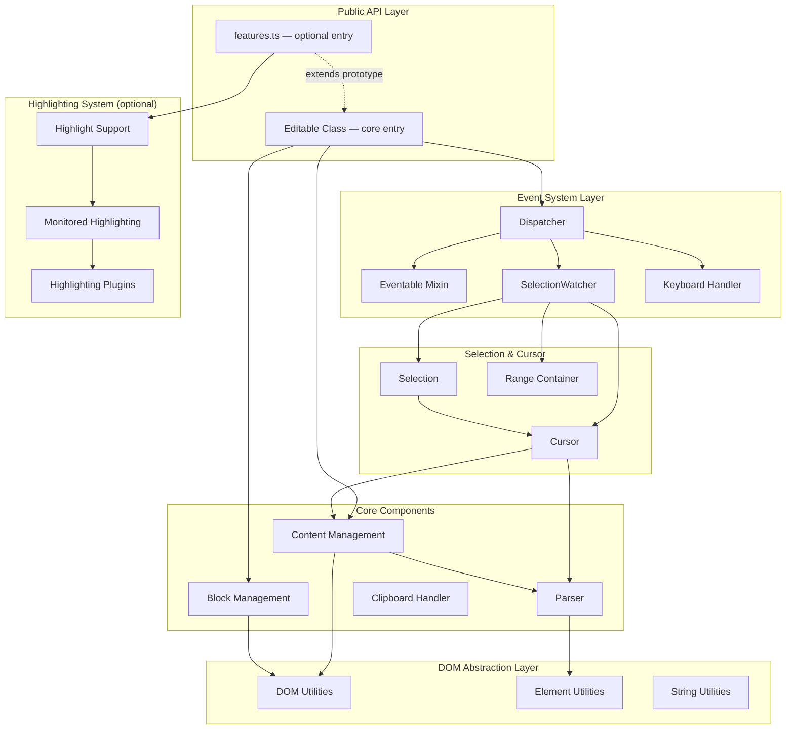
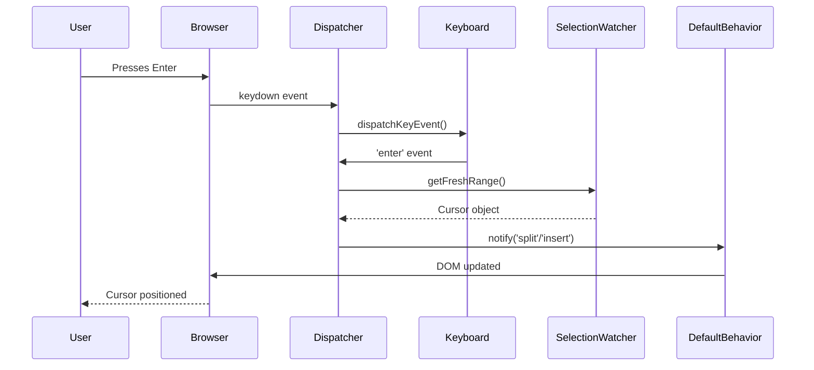
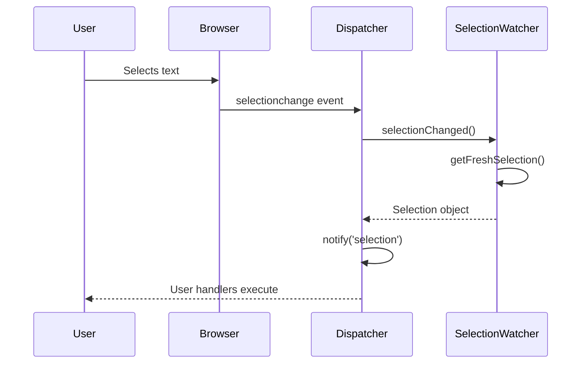

# Architecture

editable.ts follows a layered architecture that separates concerns and provides clear extension points.

## High-Level Architecture



## Core Components

### 1. Editable Class (`core.ts`)

The main npm entry (`editable.ts`) and the lean public API: block editing, events, cursor/selection, and content extraction. Optional APIs (highlighting, monitored spellcheck overlays, text-diff) live behind a separate entry — import `editable.ts/features` once if you need those methods (they register on the same `Editable` class).

**Key Responsibilities (core entry):**

- Exposes the public API for end users
- Manages instance-specific configuration snapshots (including optional `pastedHtmlRules`)
- Registers block ownership so events are routed to the correct instance
- Delegates to specialized modules
- Provides cursor/selection creation utilities

**Instance ownership:**

Each `Editable` instance maintains a registry of its editable blocks (`WeakMap` globally, `Set` per instance for lifecycle). `add()` / `enable()` claim blocks; `remove()` releases them; `disable()` keeps ownership so a later `enable()` restores the same instance binding. If a block is added to a second instance, ownership transfers to the latest instance (controlled takeover).

`getEditableBlockByEvent()` resolves the nearest editable host and returns it only when the current instance owns that block. Native document listeners remain shared per document/event/capture via `shared-document-listeners.ts`.

**Configuration:**

- `Editable.globalConfig()` deep-merges into the global defaults and affects new instances.
- `Editable.getGlobalConfig()` returns a defensive copy.
- Each instance stores an immutable snapshot in `globalSettings` at construction time; optional constructor `pastedHtmlRules` are deep-merged into that snapshot.
- Paste sanitization uses the instance snapshot (`pasteRules`), not the live global singleton.

**Rich-text formats and host policy:**

- `InlineFormatRegistry` (`inline-format-codec.ts`) lives in **core** — not under `./yjs`. Codecs map DOM inline marks ↔ canonical operation / Y.Text attribute keys (`bold`, `italic`, `link`, `superscript`, …).
- `EditableHostPolicy` (`host-policy.ts`) is installed per block via `editable.add(host, options)`. Policy controls allowed formats, line breaks, length validation, placeholder UI, and optional custom registries.
- The same registry instance flows through operation capture → `operation-apply` → optional Yjs delta conversion / reconcile. Core does **not** import the `yjs` npm package; `validate:core-bundle` walks the full `lib/core.js` dependency graph and rejects any `lib/yjs/` import.

**SSR and iframe safety:**

- Module import does not require browser globals; `new Editable()` resolves `{ window }` or the current browser window and throws a clear error otherwise.
- Feature detection (`getWindowFeatures(win)`) is cached per `Window` in a `WeakMap`.
- DOM helpers avoid cross-realm `instanceof` checks; nodes are validated via `nodeType` and `ownerDocument`.
- Ranges, fragments, and text nodes are created from the relevant `ownerDocument` / configured `Window`.
- `add()` / `enable()` can adopt cross-realm elements via `document.adoptNode()`.

**Input pipeline:**

```
native event (beforeinput preferred, keydown fallback)
  -> input normalization (inputType / key+code, composition guard)
  -> EditableCommand (typed discriminated union)
  -> beforeCommand (optional cancel via CommandContext)
  -> command event
  -> legacy events (insert, split, merge, newline, paste, toggleBold, toggleEmphasis)
  -> default/custom behavior handlers
  -> change (once per actual edit; optional ChangeDetails payload)
```

- `beforeinput` handles editing `inputType`s when supported (`insertParagraph`, `insertLineBreak`, `deleteContentBackward`, `deleteContentForward`, `formatBold`, `formatItalic`). `insertFromPaste` is delegated to the existing secure `paste` listener.
- `keydown` remains for arrow navigation, Tab/Esc, and as fallback when `beforeinput` is unavailable or did not run.
- Composition state (`compositionstart`/`compositionend`, `isComposing`, keyCode `229`) blocks structural commands until composition completes.

**Command API:**

Structural browser input is normalized into a discriminated union (`EditableCommand`):

| Command type      | Legacy event(s)                   |
| ----------------- | --------------------------------- |
| `insertBlock`     | `insert`                          |
| `splitBlock`      | `split`                           |
| `mergeBlock`      | `merge`                           |
| `insertLineBreak` | `newline`                         |
| `paste`           | `paste`                           |
| `format`          | `toggleBold` / `toggleEmphasis`   |
| `input`           | (metadata only; plain text input) |

Each command carries `host`, `source` (`keyboard` | `beforeinput` | `paste` | `api`), optional `inputType`, optional `nativeEvent`, and stable **UTF-16 code unit** cursor/selection offsets (same indexing as JavaScript strings and DOM `Range#toString()` — emoji surrogate pairs count as two units; combining marks are separate units).

`beforeCommand` receives a `CommandContext` with `cancel()` to prevent default DOM behavior without exposing native `preventDefault`. With `defaultBehavior: false`, listen to `command` and translate payloads into your document model; legacy events still fire once for 1.x compatibility.

**Key Methods (core entry):**

- `add()` / `remove()` — Enable/disable editable functionality
- `enable()` / `disable()` — Control editable state
- `on()` / `off()` — Event subscription
- `getSelection()` — Get current selection/cursor
- `getContent()` — Extract clean content

**Additional methods when using `editable.ts/features`:**

- `highlight()`, `getHighlightPositions()`, `removeHighlight()`, `decorateHighlight()`
- `setupHighlighting()`, `setupSpellcheck()`, `setupTextDiff()`

### 2. Dispatcher (`dispatcher.ts`)

Central event coordination hub that bridges native DOM events to the internal event system.

**Event Flow:**

```
Native DOM Event
    ↓
Dispatcher (setupDocumentListener)
    ↓
Event Handler (filter by editable block)
    ↓
SelectionWatcher (get current selection/cursor)
    ↓
Dispatcher.notify() (emit internal event)
    ↓
Event Handlers (user-defined callbacks)
```

### 3. Event System (`eventable.ts`)

Lightweight publish/subscribe mixin implementing the Observer pattern.

**API:**

- `on(event, handler)` — Subscribe to events
- `off(event, handler)` — Unsubscribe from events
- `notify(event, ...args)` — Publish events

### 4. Selection & Cursor System

**SelectionWatcher** — Monitors browser Selection API and converts to internal Cursor/Selection objects.

**Cursor** — Represents a collapsed selection (cursor position) with capabilities for:

- Position querying (beginning, end, line detection)
- Content insertion/manipulation
- Tag detection (bold, italic, links, etc.)
- Coordinate calculations

**Selection** — Extends Cursor, represents a non-collapsed selection with additional capabilities:

- Text/HTML extraction
- Selection wrapping (links, formatting)
- Range validation
- Multiple rect support

### 5. Block Management (`block.ts`)

Manages the lifecycle and state of individual editable block elements.

### 6. Content Management (`content.ts`)

Handles all content manipulation, extraction, and normalization:

- HTML normalization
- Content extraction (removes internal markers)
- Fragment creation
- Tag wrapping/unwrapping

### 7. Highlighting System

Comprehensive highlighting support including:

- Spellcheck integration
- Text search highlighting
- Range-based highlighting
- Highlight persistence during editing
- Custom highlight types
- Text diff overlays for inserted and deleted content

## TypeScript Notes

The codebase uses TypeScript types as architectural boundaries rather than just annotations:

- `src/event-types.ts` centralizes public and internal event payloads
- `src/plugin-types.ts` defines configuration contracts for highlighting, spellcheck, and text diff
- `src/dom-compat.ts` isolates legacy DOM/jQuery-like compatibility helpers

This keeps browser-facing code flexible while making the main editing pipeline easier to evolve safely.

## Data Flow Examples

### User Types Enter Key



### User Selects Text



## Source Map

| Module                                                          | Role                                                |
| --------------------------------------------------------------- | --------------------------------------------------- |
| [core.ts](../src/core.ts)                                       | Main `Editable` class (npm entry)                   |
| [features.ts](../src/features.ts)                               | Optional entry: highlighting, spellcheck, text-diff |
| [cursor.ts](../src/cursor.ts)                                   | Cursor manipulation API                             |
| [selection.ts](../src/selection.ts)                             | Selection manipulation API                          |
| [dispatcher.ts](../src/dispatcher.ts)                           | Event system internals                              |
| [create-default-behavior.ts](../src/create-default-behavior.ts) | Default behavior implementation                     |
