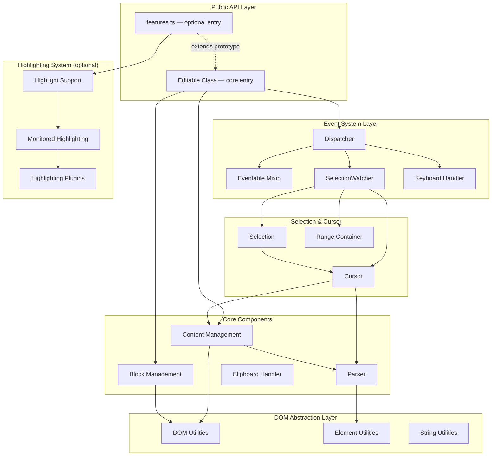
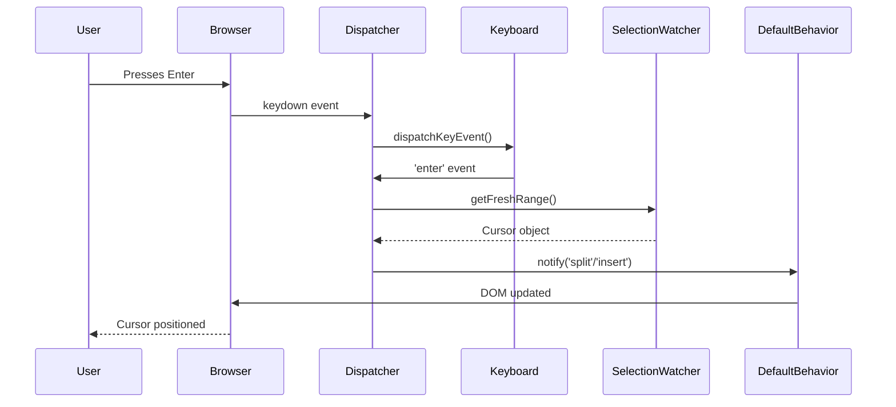
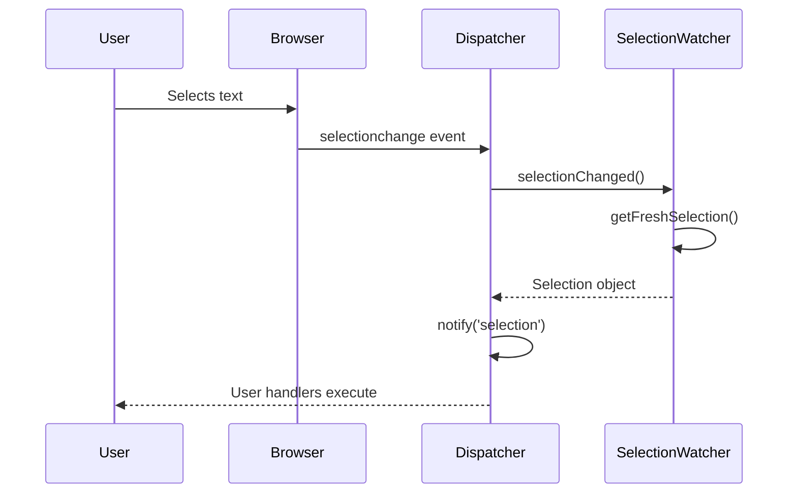

# Architecture

editable.ts follows a layered architecture that separates concerns and provides clear extension points.

## High-Level Architecture



## Core Components

### 1. Editable Class (`core.ts`)

The main npm entry (`editable.ts`) and the lean public API: block editing, events, cursor/selection, and content extraction. Optional APIs (highlighting, monitored spellcheck overlays, text-diff) live behind a separate entry — import `editable.ts/features` once if you need those methods (they register on the same `Editable` class).

**Key Responsibilities (core entry):**

- Exposes the public API for end users
- Manages instance-specific configuration
- Delegates to specialized modules
- Provides cursor/selection creation utilities

**Key Methods (core entry):**

- `add()` / `remove()` — Enable/disable editable functionality
- `enable()` / `disable()` — Control editable state
- `on()` / `off()` — Event subscription
- `getSelection()` — Get current selection/cursor
- `getContent()` — Extract clean content

**Additional methods when using `editable.ts/features`:**

- `highlight()`, `getHighlightPositions()`, `removeHighlight()`, `decorateHighlight()`
- `setupHighlighting()`, `setupSpellcheck()`, `setupTextDiff()`

### 2. Dispatcher (`dispatcher.ts`)

Central event coordination hub that bridges native DOM events to the internal event system.

**Event Flow:**

```
Native DOM Event
    ↓
Dispatcher (setupDocumentListener)
    ↓
Event Handler (filter by editable block)
    ↓
SelectionWatcher (get current selection/cursor)
    ↓
Dispatcher.notify() (emit internal event)
    ↓
Event Handlers (user-defined callbacks)
```

### 3. Event System (`eventable.ts`)

Lightweight publish/subscribe mixin implementing the Observer pattern.

**API:**

- `on(event, handler)` — Subscribe to events
- `off(event, handler)` — Unsubscribe from events
- `notify(event, ...args)` — Publish events

### 4. Selection & Cursor System

**SelectionWatcher** — Monitors browser Selection API and converts to internal Cursor/Selection objects.

**Cursor** — Represents a collapsed selection (cursor position) with capabilities for:

- Position querying (beginning, end, line detection)
- Content insertion/manipulation
- Tag detection (bold, italic, links, etc.)
- Coordinate calculations

**Selection** — Extends Cursor, represents a non-collapsed selection with additional capabilities:

- Text/HTML extraction
- Selection wrapping (links, formatting)
- Range validation
- Multiple rect support

### 5. Block Management (`block.ts`)

Manages the lifecycle and state of individual editable block elements.

### 6. Content Management (`content.ts`)

Handles all content manipulation, extraction, and normalization:

- HTML normalization
- Content extraction (removes internal markers)
- Fragment creation
- Tag wrapping/unwrapping

### 7. Highlighting System

Comprehensive highlighting support including:

- Spellcheck integration
- Text search highlighting
- Range-based highlighting
- Highlight persistence during editing
- Custom highlight types
- Text diff overlays for inserted and deleted content

## TypeScript Notes

The codebase uses TypeScript types as architectural boundaries rather than just annotations:

- `src/event-types.ts` centralizes public and internal event payloads
- `src/plugin-types.ts` defines configuration contracts for highlighting, spellcheck, and text diff
- `src/dom-compat.ts` isolates legacy DOM/jQuery-like compatibility helpers

This keeps browser-facing code flexible while making the main editing pipeline easier to evolve safely.

## Data Flow Examples

### User Types Enter Key



### User Selects Text



## Source Map

| Module                                                          | Role                                                |
| --------------------------------------------------------------- | --------------------------------------------------- |
| [core.ts](../src/core.ts)                                       | Main `Editable` class (npm entry)                   |
| [features.ts](../src/features.ts)                               | Optional entry: highlighting, spellcheck, text-diff |
| [cursor.ts](../src/cursor.ts)                                   | Cursor manipulation API                             |
| [selection.ts](../src/selection.ts)                             | Selection manipulation API                          |
| [dispatcher.ts](../src/dispatcher.ts)                           | Event system internals                              |
| [create-default-behavior.ts](../src/create-default-behavior.ts) | Default behavior implementation                     |
